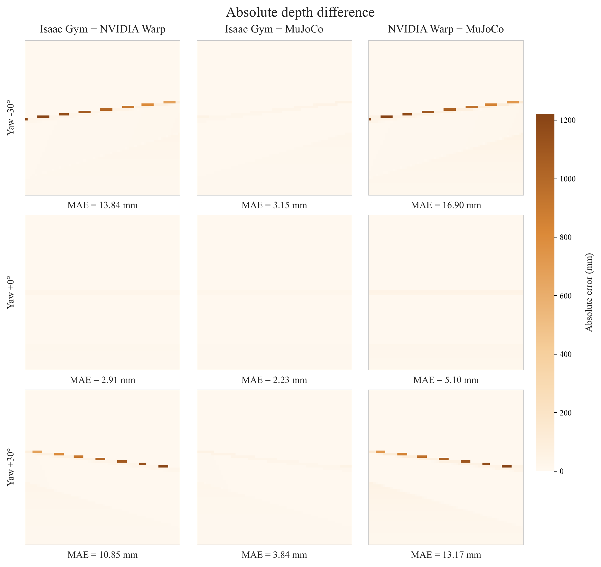

# WMP_Go1：高效训练与 Sim-to-Sim / Sim-to-Real 部署

本仓库基于 [WMP（World Model-based Perception for Visual Legged Locomotion）](https://wmp-loco.github.io/) 开源代码进行修改。

原始仓库通过 Isaac Gym Camera API 获取深度图。
在大规模并行训练中，相机 API 会带来较高的渲染与数据读取开销。
同时，原始仓库主要面向训练与仿真验证，没有提供完整的部署代码。
本仓库围绕训练效率、复杂地形泛化、策略导出和 Sim-to-Real 部署进行了系统修改，并完成了 MuJoCo、Gazebo 与 Go1 实机测试。

原始项目的介绍、作者、致谢和引用信息见 [README_WMP_ORIGINAL.md](doc/README_WMP_ORIGINAL.md)。

## 主要贡献

1. **基于 NVIDIA Warp 的深度渲染**：将深度图获取方式由 Isaac Gym Camera API 改为 GPU 并行射线检测，大幅提升视觉策略训练速度。

2. **端到端策略导出**：将 World Model、History Encoder 和 Actor 打包为一个 TorchScript `.pt` 文件，方便在仿真和实机上部署。

3. **复杂地形扩展**：新增 `bream`、`stepping_one_bridge`、`stool` 和 `continuous_gap`，提升策略在真实环境中的泛化能力。

4. **速度指令采样与本体感知增强**：调整不同地形下的速度指令采样，增强策略对本体感知信息的利用，提高 Sim-to-Real 表现。

5. **训练与机器人适配**：调整机器人重置地形位置，更新 AMP 动作数据集，适配 Unitree Go1。

6. **工具支持**：添加批量录制、地形等级绘图、深度图对比、后端测试、日志管理、AMP 动作采集和 MuJoCo 动作可视化脚本。

7. **仿真与实机迁移**：完成 MuJoCo、Gazebo 和 Unitree Go1 实机测试，部署端使用统一导出的端到端策略。

## Isaac Gym、MuJoCo 与 NVIDIA Warp 深度误差对比



- 三个后端两两对比，在 −30°、0° 和 +30° 偏航角下的 MAE 为 0.002–0.017 m。
- 较大的局部误差主要集中在墙体边缘，Warp 整体深度分布与 Isaac Gym、MuJoCo 基本一致。

## 环境安装

基础环境与 Isaac Gym 安装方式可参考 [原始 WMP 安装说明](doc/README_WMP_ORIGINAL.md#requirements)。

扩展功能还需要 NVIDIA Warp、MuJoCo、dm_control、OpenCV、TensorBoard、ffmpeg 和 Matplotlib，建议按照报错提示安装。


## Train

```bash
# 从头训练
CUDA_VISIBLE_DEVICES=0 ./bash/leggedskill.sh -t

# 从指定 checkpoint 恢复训练
CUDA_VISIBLE_DEVICES=0 ./bash/leggedskill.sh -t --resume --path /path/to/model_1000.pt
```

建议训练超过 2 万次迭代，以获得较稳定的策略效果。
`CUDA_VISIBLE_DEVICES` 用于选择物理 GPU。
训练默认使用 `a1_amp` 任务并自动启用 `--headless`。
恢复训练时，`--path` 与 `--resume` 一起使用，建议直接指向 `.pt` checkpoint 文件。

## Play

```bash
# 加载最新 checkpoint
CUDA_VISIBLE_DEVICES=0 ./bash/leggedskill.sh -p --terrain climb

# 加载指定 checkpoint
CUDA_VISIBLE_DEVICES=0 ./bash/leggedskill.sh -p --terrain climb --path /path/to/model_1000.pt
```

Play 默认导出策略并录制视频，无显示环境时添加 `--headless`。
`--terrain` 指定测试地形；不提供 `--path` 时默认加载最新 checkpoint。

## Terrain View

```bash
# 自动选择 checkpoint 查看完整训练地形
CUDA_VISIBLE_DEVICES=0 ./bash/leggedskill.sh -v
```

该模式调用 `legged_gym/scripts/view_terrain.py`，用于显示完整的训练地形分布和机器人运行效果。

## Sim-to-Sim 与 Sim-to-Real 部署

S2S（MuJoCo、Gazebo）和 S2R（Unitree Go1 实机）部署代码及使用说明，
请查看 [haozhang04/LeggedSkillDeploy](https://github.com/haozhang04/LeggedSkillDeploy) 仓库的 `wmp_parkour` 分支：

```bash
git clone -b wmp_parkour https://github.com/haozhang04/LeggedSkillDeploy.git wmp_parkour
```

## 工具

预览日志压缩：

```bash
python tool/logs_compress.py
```

预览旧模型清理：

```bash
python tool/logs_delete.py
```

批量录制默认地形：

```bash
python tool/record_all_terrains.py --headless --runs /path/to/<run1> <run2>
```

绘制地形等级：

```bash
python tool/plot_terrain_level.py --paths /path/to/run
```

比较 Isaac、Warp、MuJoCo 深度图：

```bash
python tool/depth_tools.py all --backend isaac warp mujoco --out /path/to/new_depth_run
```

播放 AMP 动作：

```bash
python tool_mujoco/visualize_mocap_mujoco.py
```

采集 Go1 参考动作：

运行前按脚本头部说明配置部署仓库路径和策略模型。

```bash
python tool_mujoco/collect_reference_motions.py
```

日志压缩和清理工具添加 `--y` 后才会实际执行。其他参数和详细用法见对应脚本头部注释。

## 相关文档

- [网络架构](doc/NET.md)：模型组成、输入输出及推理流程。
- [TensorBoard](doc/TENSORBOARD_REMOTE.md)：TensorBoard 训练日志查看。
- [地形速度课程](doc/TERRAIN_COMMANDS.md)：课程分组、速度范围与采样规则。
- [地形参数](doc/TERRAIN_PARAMETERS.md)：地形生成、难度设置与机器人出生位置。

## 致谢

感谢 [WMP](https://wmp-loco.github.io/) 原作者及相关开源项目作者的贡献。

**如果这个项目对你有帮助，请给我点个 Star ⭐！**
